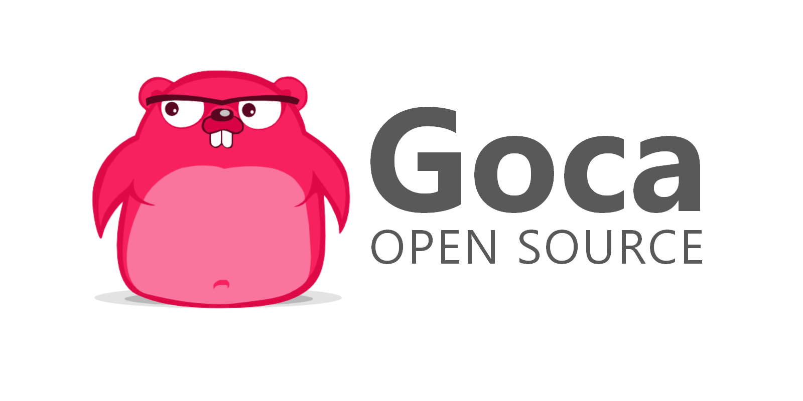

[](https://t.me/GocaIO) 
[](https://travis-ci.org/Gocaio/goca)
[](https://github.com/gocaio/goca/issues)
[](https://github.com/Gocaio/goca/tags)
[](https://golang.org/dl/)
[](https://www.apache.org/licenses/LICENSE-2.0)
[](https://github.com/Gocaio/goca/blob/master/CONTRIBUTING.md)

**Goca** is a [FOCA](https://github.com/ElevenPaths/FOCA) fork written in Go, which is a tool used mainly to find metadata and hidden information in the documents its scans. These documents may be on web pages, and can be downloaded and analyzed with **Goca**.

It is capable of analyzing a wide variety of documents, with the most common being Microsoft Office, Open Office, or PDF files, although it also analyzes Adobe InDesign or SVG files, for instance.

These documents are searched for using search engines such as:

+ [x] Google
+ [ ] Bing
+ [ ] DuckDuckGo
+ [ ] Yahoo
+ [ ] Ask

Then downloads the documents and extracts the EXIF information from graphic files, and a complete analysis of the information discovered through the URL is conducted even before downloading the file.

***

## USAGE

Download built packages from [**Releases**](https://github.com/Gocaio/goca/releases)

To build from source, you will need Go installed.

```bash
$ export GO111MODULE=on 
$ go get ./...
$ go run goca/goca.go -h
```

To run Goca from Docker:

```bash
$ docker build -t gocaio/goca /path/to/goca
$ docker run gocaio/goca -h
```

***

## Contributing Guide

Please reade the Contributing guide:

+ [Contributing](CONTRIBUTING.md)

***

## Documentation

Refer to the [Official Doc](https://github.com/gocaio/Doc).
